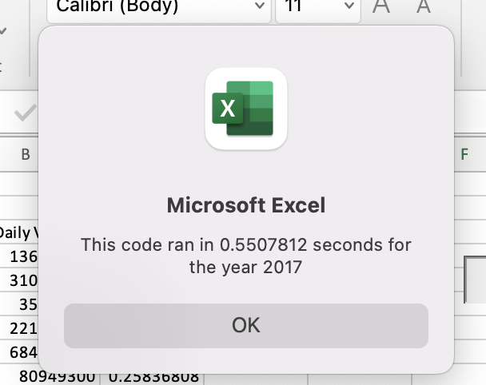
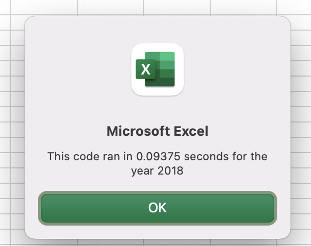
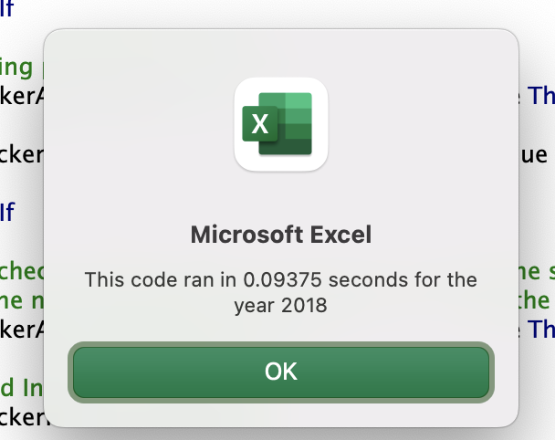

# Analysis of Results #

Overview of Project
-------------------

Steve is a friend that just graduated with his finance degree. His parents want to invest in green energy stocks. There are many forms of green energy to invest in like hydroelectricity, wind energy, geothermal energy and bioenergy, but his parents didn't do much research and just decided to invest all their money into Daqo New Energy Corporation. Daqo (DQ) is a company that makes silicon wafers for solar panel.

While Steve promised to look into DQ stock for his parents, he's also concerned that they should be diversifying their investment. He wants to analyse some of green energy stocks in addition to DQ's stock so he can better help them with the decision.

Steve has created an Excel file containing all the stock data he wants to analise. He is somewhat savvy in Excel, but he asked me to help him with his analysis. Steve wants to find the total daily volume and yearly return for each stock. 

Daily volume is the total number of shares traded throughout the day and it measures how actively a stock is traded. The yearly return is the percentage difference in price from the beginning of the year to the end of the year. 

Steve thinks that if we have all this information he will be better prepared to give a solid advice to his parents about their investment portfolio.

We created a worksheet named All Stocks Analysis, and we are analyzing the total daily volume and the return of the following stocks: AY, CSIQ, DQ, ENPH, FSLR, HASI, JKS, RUN, SEDG, SPWR, TERP and VSLR.

To be able to synthesize all the data from the two previous years, we built a macro that first asks the year that we would like to analise. Then we create an array with all the stock's tickers to compare them with the data. Finaly, we iterate over all the rows in the spreadsheet and calculate total daily volume and return (end prices / start price - 1).

Results
-------

Before the refactoring we used a nested loop to go through the data. So the time that it took was greater as we can see in the pictures:

The nested loop:
________________________
    'loop tickerArray
    For i = 0 To 11

        ticker = tickerArray(i)
        totalVolume = 0

        Sheets(yearValue).Activate
        
        'loop rows
        For j = 2 To RowCount

            'total volume for current ticker
            If ticker = Cells(j, 1).Value Then

               totalVolume = totalVolume + Cells(j, 8).Value

            End If
            
            'starting price for current ticker
            If ticker <> Cells(j - 1, 1).Value And ticker = Cells(j, 1).Value Then

                startingPrice = Cells(j, 6).Value

            End If
            
            'ending price for current ticker
            If ticker <> Cells(j + 1, 1).Value And ticker = Cells(j, 1).Value Then

                endingPrice = Cells(j, 6).Value
            
            End If

        Next j
        
        'output data for current ticker
        
        Worksheets("All Stocks Analysis").Activate
        
        Cells(4 + i, 1).Value = ticker
        Cells(4 + i, 2).Value = totalVolume
        Cells(4 + i, 3).Value = endingPrice / startingPrice - 1
        
    Next i
________________________

After the refactoring the time decreased as we only have single loops in the code. We can see the new results at:

The single loop:
_________________________
    '2b) Loop over all the rows in the spreadsheet.
    For i = 2 To RowCount

        '3a) Increase volume for current ticker
        If tickerArray(tickerIndex) = Cells(i, 1).Value Then

            tickerVolumes(tickerIndex) = tickerVolumes(tickerIndex) + Cells(i, 8).Value

        End If
        
        '3b) Return
        'starting price for current ticker
        If tickerArray(tickerIndex) <> Cells(i + -1, 1).Value Then
            
            tickerStartingPrices(tickerIndex) = Cells(i, 6).Value
            
        End If
            
        'ending price for current ticker
        If tickerArray(tickerIndex) <> Cells(i + 1, 1).Value Then

            tickerEndingPrices(tickerIndex) = Cells(i, 6).Value
            
        End If
        
        '3c) check if the current row is the last row with the selected ticker
        'If the next row’s ticker doesn’t match, increase the tickerIndex.
        If tickerArray(tickerIndex) <> Cells(i + 1, 1).Value Then
            
            '3d Increase the tickerIndex.
            tickerIndex = tickerIndex + 1
            
        End If
        
    Next i
_______________________

Summary
-------

### Advantages of refactoring code

- Creates a more understandable code that facilitates maintenance and the extendibility of the software

- Removes redundancies and duplications to improve the effectiveness of the code

- Makes performance of the software better 

### Disadvantages of refactoring code

- Imprecise refactoring could introduce new bugs and errors into the code

- An improved code is often difficult for the customer to recognize, since the functionality stays the same, i.e. the benefit is not self-evident

### Pros and cons that apply to refactoring the original VBA script

As Steve plans to use the excel spreadsheet with other stocks and data from other years, we'll need to keep refactoring the code. First thing was to make the performance better by removing the nested loop that could increase processing time if we keep adding more stocks in the spreadsheet. A single loop can perform in O (n), but a nested loop is O (n*m), which means for a single loop of 3000 rows, we will be performing 3000 iterations and for another single loop of 10 tickers, the total would be 3010 iterations. But for a nested loop of 10 * 3000 we would have 30000 iterations and as we have more stocks, we will have more rows and tickers, so this number could grow a lot.

So this step was necessary so the excel can accommodate more stocks in the future by improving the scalability of the code.

The con was that as it was the time was still ok as we didn't have that many stocks, so Steve won't probably even notice it. And we could always introduce bugs in the code by performing the refactory, but lets just hope that we didn't.
